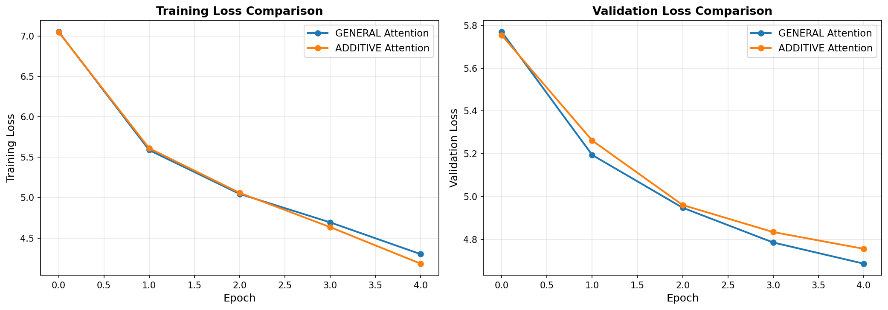
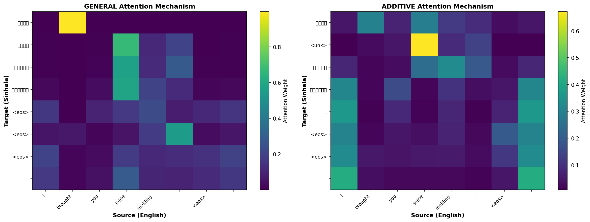

# Sinhala–English Neural Machine Translation using Transformers

This project evaluates the translation performance of a **Transformer-based neural machine translation model** for the **Sinhala–English low-resource language pair**, comparing **general attention** and **additive attention mechanisms**. The translation direction considered in this study is **English → Sinhala**.

---

## Dataset Selection and Source

This project focuses on **machine translation between English and Sinhala**, where **Sinhala** is the primary native language spoken in Sri Lanka. Sinhala is a **morphologically rich and low-resource language**, and the limited availability of high-quality NLP tools makes Sinhala–English translation particularly challenging.

To address this challenge, a well-established and reputable public parallel corpus is used.

### Dataset: OpenSubtitles2016

- **Source:** OpenSubtitles.org  
- **Accessed via:** OPUS – Open Parallel Corpus  
- **Reference:**  
  Lison, P., & Tiedemann, J. (2016). *OpenSubtitles2016: Extracting Large Parallel Corpora from Movie and TV Subtitles*. Proceedings of LREC 2016.

The OpenSubtitles2016 dataset is a large-scale parallel corpus extracted from movie and TV subtitles. It contains sentence-aligned translations across more than 60 languages and is widely used in neural machine translation research, particularly for **low-resource language pairs** such as Sinhala–English.

The dataset includes several improvements:
- Better sentence alignment  
- Automatic OCR error correction  
- Language identification and quality scoring  

**Important credit note:**  
As required by the dataset providers, any use of OpenSubtitles data must include a reference and link to:  
http://www.opensubtitles.org/

---

## Dataset Preparation and Preprocessing

To make the OpenSubtitles Sinhala–English data suitable for training a Transformer-based neural machine translation model, several preprocessing steps were applied. These steps are necessary due to the noisy nature of subtitle data and the linguistic characteristics of Sinhala.

### Data Cleaning and Normalization

Each English–Sinhala sentence pair was processed using a custom normalization pipeline:

- Converted all text to **lowercase**
- Removed extra whitespace
- Filtered out unwanted symbols while preserving:
  - English alphanumeric characters and punctuation
  - Sinhala Unicode character range (U+0D80 – U+0DF8)
- Removed empty sentence pairs
- Removed duplicate sentence pairs
- Filtered sentence length to **3–80 words** for both languages
- Limited the dataset to **100,000 sentence pairs** due to computational resource constraints

**Libraries used:**
- `re` (Python standard library) – regex-based text cleaning  
- `collections` – duplicate detection  

---

## Tokenization and Language-Specific Challenges

### Sinhala Language Considerations

Sinhala is a **morphologically rich language** with complex word formations. However, it lacks mature and widely adopted tokenization and word segmentation tools compared to high-resource languages. As a result, traditional word-level tokenization often leads to:

- Large vocabularies  
- High out-of-vocabulary (OOV) rates  
- Poor generalization  

Due to these limitations, **subword-level tokenization** was selected for this project.

---

## Subword Tokenization using Byte Pair Encoding (BPE)

This project uses **Byte Pair Encoding (BPE)** tokenization for both English and Sinhala, which has been shown in previous research to improve translation quality for low-resource language pairs.

Benefits of using BPE include:
- Reduced vocabulary size  
- Effective handling of rare and unseen words  
- Improved generalization  

**Tool used:**
- **Hugging Face `tokenizers` library**
  - Model: `BPE`
  - Trainer: `BpeTrainer`

**Special tokens used:**

<unk>, <pad>, <bos>, <eos>, <sep>

Separate BPE tokenizers were trained for:
- English (`vocab_size = 8000`)
- Sinhala (`vocab_size = 8000`)

The trained tokenizers are saved in JSON format and reused during training and evaluation.

**Credit:**  
Hugging Face Tokenizers – https://github.com/huggingface/tokenizers

---

## Dataset Splitting

After preprocessing and tokenization, the dataset was split into:

- **Training set:** 70%  
- **Validation set:** 15%  
- **Test set:** 15%  

This split ensures reliable evaluation and prevents data leakage.

**Library used:**
- `scikit-learn` (`train_test_split`)

---

## Model Performance Techniques

To improve translation performance and training stability for the low-resource **English–Sinhala** task, the following techniques were applied:

- **AdamW optimizer**
- **Noam learning rate scheduler**
- **Automatic Mixed Precision (AMP)**
- **Label smoothing**

These techniques contribute to faster convergence, better generalization, and more stable Transformer training on limited data.

---

## Experimental Results and Analysis

### Attention Mechanism Performance Comparison

The performance of the Transformer model using different attention mechanisms is summarized below.

#### Performance Comparison Table
*(Insert image of the performance comparison table)*

## Attention Mechanism Performance Comparison

| Attention Mechanism | Computational Efficiency (s) | Training Loss | Training PPL | Validation Loss | Validation PPL |
|---------------------|------------------------------|---------------|--------------|-----------------|----------------|
| General             | 702.38                       | 4.3008        | 73.76        | 4.6862          | 108.44         |
| Additive            | 838.13                       | 4.1830        | 65.56        | 4.7556          | 116.24         |

---

### Training and Validation Loss Comparison

The following plots show the training and validation loss for:
- **General Attention**
- **Additive (Adaptive) Attention**

  

From the loss curves, it is observed that the **general attention model performs better** than the additive attention model.

---

### Attention Map Visualization

The attention maps generated by each model are shown below.

  

---

## Results Summary

## Performance Comparison Table

| Attention Type | Test Loss | Test Perplexity |
|----------------|-----------|-----------------|
| General        | 3.7867    | 44.11           |
| Additive      | 3.8355    | 46.32           |

- The **general attention model** converges faster than the additive attention model
- It achieves better translation quality for **English → Sinhala**
- It is computationally more efficient
- Overall, the **general attention mechanism outperforms the additive attention mechanism** for this low-resource translation task

---

